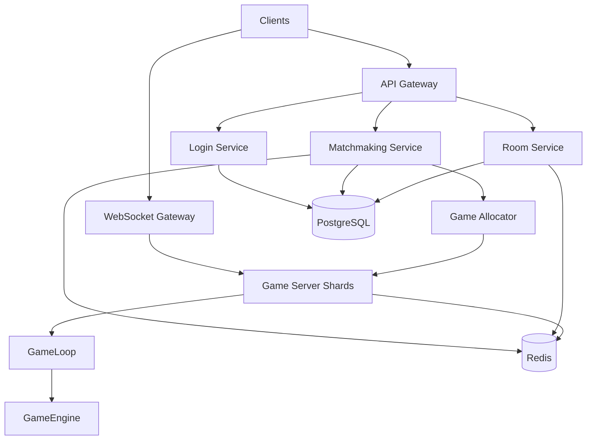

# Server Design - Kung Fu Chess

## 1. מטרת המערכת

המערכת היא משחק שחמט בזמן אמת המבוסס על ארכיטקטורת Client-Server.

השרת אחראי על:

* ניהול מצב המשחק.
* הרצת חוקי המשחק.
* התאמת משתמשים למשחקים.
* ניהול חדרים.
* ניהול חיבורים פעילים.
* שמירת מידע קבוע וזמני.
* ניתוב משחקים בין שרתי המשחק.

המטרה היא לתכנן מערכת שרתית מודולרית, הניתנת להרחבה (Scalable), המסוגלת לתמוך בכמות גדולה של משתמשים באמצעות חלוקת אחריות בין שירותים עצמאיים, שימוש במספר מופעים לכל שירות, ותשתיות Container ו־Cloud.

---

# 2. דרישות מערכת

המערכת צריכה לתמוך בדרישות הבאות:

* תמיכה בכ־100 מיליון משתמשים רשומים.
* תמיכה בכ־10 מיליון משתמשים פעילים במקביל.
* תמיכה במספר גדול של משחקים בו־זמנית.
* אפשרות לכל משתמש להצטרף לכל חדר.
* התאמת שחקנים לפי Rating.
* ניהול חדרים וצופים.
* שמירת משתמשים, דירוגים ותוצאות משחקים.
* התחברות מחדש (Reconnect) למשחק פעיל.
* הגדלה דינמית של המערכת בהתאם לעומס.
* הפרדת אחריות מלאה בין שירותי המערכת.

---

# 3. ארכיטקטורת המערכת

המערכת מחולקת למספר שירותים עצמאיים.

כל שירות אחראי על תחום אחר במערכת, וניתן להריץ מספר מופעים ממנו בהתאם לעומס.

מבנה כללי:



---

## API Gateway

API Gateway מטפל בכל הבקשות שאינן דורשות תקשורת בזמן אמת.

אחריות:

* Login.
* Register.
* Profile.
* History.
* Rooms.
* קבלת מידע סטטי.
* ניתוב בקשות לשירות המתאים.

API Gateway אינו מכיל לוגיקת משחק.

---

## WebSocket Gateway

WebSocket Gateway אחראי על כל החיבורים החיים מול הלקוחות.

תפקידים:

* יצירת חיבור WebSocket.
* שמירת החיבור הפעיל.
* העברת פקודות משחק אל שרת המשחק.
* שליחת Snapshots ועדכוני מצב.
* טיפול בחיבור מחדש.

ה־Gateway אינו מחליט האם פעולה חוקית.

כל החלטה מועברת אל Game Engine.

---

## Login Service

אחראי על:

* התחברות משתמשים.
* אימות משתמש.
* יצירת Session.
* טעינת מידע בסיסי של המשתמש.
* ניהול Tokens במידת הצורך.

מידע קבוע נשמר ב־PostgreSQL.

Sessions נשמרים ב־Redis.

---

## Matchmaking Service

אחראי על:

* ניהול תור המתנה.
* התאמת שחקנים לפי Rating.
* יצירת משחק חדש.
* שליחת בקשה ל־Game Allocator.

התור הפעיל נשמר ב־Redis.

---

## Room Service

אחראי על:

* יצירת חדרים.
* רשימת חדרים.
* כניסה לחדר.
* יציאה מחדר.
* ניהול צופים.
* מידע כללי על חדר.

Room Service אינו מפעיל את המשחק.

הוא אחראי רק על ניהול החדר.

---

## Game Allocator

כאשר Matchmaking יוצר משחק חדש, עליו לבחור היכן המשחק ירוץ.

לשם כך קיים Game Allocator.

תפקידיו:

* בחירת Game Server מתאים.
* בדיקת עומס על כל שרת.
* חלוקת משחקים בצורה מאוזנת.
* רישום המשחק במערכת.

לאחר בחירת השרת:

```
Game ID -> Game Server Instance
```

לדוגמה:

```
Game 1001 -> Server 3

Game 1002 -> Server 7
```

כך כל שירות יודע היכן נמצא כל משחק.

---

## Game Server Shards

Game Server הוא השירות שמריץ את המשחקים.

במערכת קיימים מספר מופעים של השירות.

כל מופע מנהל רק חלק מהמשחקים הפעילים.

אחריות:

* ניהול מצב המשחק.
* קבלת פעולות מהלקוחות.
* עדכון Game Engine.
* שמירת מצב המשחק בזיכרון.
* שליחת Snapshots דרך WebSocket Gateway.

Game Server אינו אחראי על Login או Matchmaking.

---

## GameLoop

GameLoop אחראי על עדכון מחזורי של כל המשחקים.

בכל מחזור:

* עדכון טיימרים.
* עדכון תנועות.
* בדיקת פעולות שהתקבלו.
* יצירת Snapshot חדש.

GameLoop אינו מנהל חיבורים לרשת.

---

## GameEngine

GameEngine הוא הליבה של המשחק.

כל חוקי המשחק נמצאים בו.

אחריות:

* חוקיות תנועות.
* עדכון מצב הלוח.
* ניהול תורות.
* זיהוי סיום משחק.
* יצירת Snapshot חדש.

GameEngine הוא ה־Single Source of Truth.

לא הלקוח ולא ה־Gateways מחליטים האם פעולה חוקית.

---

# 4. חלוקת Services ו־Scale

כל שירות ניתן להרצה במספר מופעים.

לדוגמה:

```
API Gateway

4 Instances
```

```
WebSocket Gateway

8 Instances
```

```
Matchmaking Service

3 Instances
```

```
Game Server

20 Instances
```

כל מופע מטפל רק בחלק מהעומס.

כאשר העומס גדל ניתן להוסיף מופעים נוספים ללא שינוי בקוד.

---

## ניהול משחקים בין מספר Game Servers

כאשר קיימים מספר Game Servers יש צורך לדעת היכן כל משחק נמצא.

לשם כך נשמר Game Registry.

מבנה:

```
Game ID -> Game Server Instance
```

לדוגמה:

```
Game 1540 -> Server 2

Game 2028 -> Server 6
```

Game Allocator מעדכן את הרישום בעת יצירת משחק חדש.

כך ניתן לנתב כל בקשה אל שרת המשחק המתאים.

---

# 5. זרימות מרכזיות

## 5.1 Login

1. הלקוח שולח בקשת Login אל API Gateway.
2. API Gateway מעביר את הבקשה אל Login Service.
3. Login Service מאמת את המשתמש.
4. Session נשמר ב־Redis.
5. מידע קבוע נשמר או נקרא מ־PostgreSQL.
6. המשתמש מקבל תשובה עם פרטי ההתחברות.

---

## 5.2 Matchmaking

1. המשתמש נכנס לתור.
2. Matchmaking Service מחפש שחקן מתאים.
3. לאחר שנמצאה התאמה נשלחת בקשה אל Game Allocator.
4. Game Allocator בוחר Game Server.
5. המשחק נרשם ב־Game Registry.
6. שני המשתמשים מופנים אל שרת המשחק שנבחר.

---

## 5.3 התחלת משחק

1. הלקוחות יוצרים חיבור אל WebSocket Gateway.
2. WebSocket Gateway מחבר אותם ל־Game Server המתאים.
3. Game Server טוען את מצב המשחק.
4. GameLoop מתחיל לעדכן את המשחק.
5. נשלח Snapshot ראשון לכל המשתתפים.

---

## 5.4 שליחת פעולה במשחק

1. הלקוח שולח פעולה דרך WebSocket.
2. WebSocket Gateway מעביר את הפעולה אל Game Server.
3. Game Server מעביר את הפעולה אל GameEngine.
4. GameEngine בודק את חוקיות הפעולה.
5. אם הפעולה תקינה מצב המשחק מתעדכן.
6. Snapshot חדש נשלח לכל המשתתפים.
## 5.5 Rooms

Room Service אחראי על ניהול החדרים בלבד.

תפקידיו:

* יצירת חדר.
* הצטרפות לחדר.
* יציאה מחדר.
* ניהול רשימת המשתמשים.
* ניהול רשימת הצופים.
* שמירת מידע כללי על החדר.

כאשר המשחק מתחיל, האחריות על המשחק עצמו עוברת אל Game Server.

---

## 5.6 עדכון משחקים

בכל מחזור של GameLoop:

1. מתבצע עדכון של כל המשחקים הפעילים.
2. GameEngine מעבד את הפעולות שהתקבלו.
3. מצב המשחק מתעדכן.
4. Snapshot חדש נוצר.
5. Game Server מעביר את ה־Snapshot אל WebSocket Gateway.
6. WebSocket Gateway משדר את העדכון לכל המשתתפים והצופים.

---

# 6. Database Design

המערכת משתמשת ב־PostgreSQL כמסד הנתונים המרכזי.

SQLite אינו מתאים למערכת מבוזרת בסדר גודל כזה, מכיוון שהוא מבוסס על קובץ יחיד ואינו מיועד לעומסי עבודה גבוהים או להרצה במספר שרתים.

PostgreSQL משמש לשמירת מידע קבוע כגון:

* משתמשים.
* דירוגים.
* תוצאות משחקים.
* היסטוריית משחקים.
* רשומות משחק.

דוגמת טבלת Users:

```text
id
username
password_hash
rating
created_at
```

דוגמת טבלת Games:

```text
id
player1
player2
winner
created_at
duration
```

דוגמת טבלת MoveHistory:

```text
id
game_id
move_number
piece
from_square
to_square
created_at
```

כל הגישה למסד הנתונים מתבצעת דרך שירותי השרת בלבד.

---

# 7. Redis

Redis משמש לשמירת מידע זמני הנדרש לגישה מהירה.

דוגמאות:

* Sessions.
* Active Rooms.
* Matchmaking Queue.
* Game Registry.
* Reconnect Tokens.
* מידע זמני על משחקים פעילים.

Redis מפחית עומס ממסד הנתונים ומאפשר גישה מהירה לנתונים הנדרשים בזמן אמת.

---

# 8. Service Communication

השירותים מתקשרים ביניהם באמצעות ממשקי API פנימיים.

בהתאם לצורכי המערכת ניתן להשתמש באחת או יותר מהאפשרויות הבאות:

* REST.
* gRPC.
* Redis Pub/Sub.
* NATS.

הבחירה בטכנולוגיה תלויה בדרישות הביצועים ובאופי התקשורת בין השירותים.

---

# 9. Docker

כל שירות ירוץ בתוך Docker Container נפרד.

לדוגמה:

```text
Container 1
API Gateway

Container 2
WebSocket Gateway

Container 3
Login Service

Container 4
Matchmaking Service

Container 5
Room Service

Container 6
Game Server
```

לצורך פיתוח והרצה מקומית ניתן להשתמש ב־Docker Compose.

Docker Compose מאפשר להפעיל גרסה קטנה של כל רכיבי המערכת באמצעות קובץ תצורה יחיד.

יתרונות:

* סביבת פיתוח אחידה.
* פריסה מהירה.
* בדיקות מקומיות.
* הרצת מספר שירותים יחד.

---

# 10. Kubernetes / K3s

במערכת ייצור ניתן להשתמש ב־Kubernetes או K3s לניהול ה־Containers.

תפקידי Kubernetes:

* יצירת מופעים חדשים.
* חלוקת עומסים.
* הפעלה מחדש של שירות במקרה של תקלה.
* ניהול מחזור החיים של השירותים.
* הגדלה והקטנה אוטומטית של מספר המופעים.

K3s הוא פתרון קל יותר המבוסס על Kubernetes ומתאים גם לסביבות קטנות יותר.

---

# 11. Network Estimation

נניח:

* 10 מיליון משתמשים פעילים.
* כל משתמש שולח פעולה אחת בכל שתי שניות.

חישוב:

```text
10,000,000 / 2
```

תוצאה:

```text
5,000,000 פעולות בשנייה
```

אם כל הודעה שוקלת כ־100 Bytes:

```text
5,000,000 × 100
```

תוצאה:

```text
500,000,000 Bytes/sec
```

כלומר:

```text
≈ 500 MB/sec
```

בנוסף קיימת תעבורה של:

* Snapshots.
* עדכוני מצב.
* הודעות מערכת.
* הודעות התחברות מחדש.

מסיבה זו לא ניתן להסתמך על שרת יחיד, ויש צורך בחלוקת עומסים בין מספר שרתים.

---

# 12. ניהול מחזור החיים של משחק

משחק הוא משאב זמני.

כאשר משחק חדש נוצר:

1. Matchmaking Service מוצא התאמה.
2. Game Allocator בוחר Game Server.
3. המשחק נרשם ב־Game Registry.
4. Game Server טוען את מצב המשחק לזיכרון.
5. GameLoop מתחיל לעדכן את המשחק.

במהלך המשחק:

* כל הפעולות נבדקות על ידי GameEngine.
* מצב המשחק נשמר בזיכרון.
* Snapshots נשלחים למשתתפים.

בסיום המשחק:

* התוצאה נשמרת ב־PostgreSQL.
* הנתונים הזמניים נמחקים מ־Redis.
* המשחק מוסר מ־Game Registry.
* הזיכרון משתחרר.

Container חדש אינו נוצר עבור כל משחק.

כל Game Server מסוגל לנהל מספר גדול של משחקים במקביל.

כאשר העומס גדל, Kubernetes מוסיף מופעי Game Server נוספים.

---

# 13. Observability

כדי לאפשר ניטור יעיל של המערכת, כל השירותים מספקים מידע תפעולי.

המערכת כוללת:

* Logs.
* Metrics.
* Health Checks.

מידע זה מאפשר:

* זיהוי תקלות.
* ניטור ביצועים.
* בדיקת זמינות השירותים.
* מעקב אחר עומסים.

בנוסף ניתן לבצע:

* Load Tests.
* Stress Tests.
* ניטור זמני תגובה של השירותים.

---

# 14. עקרונות תכנון

במערכת נשמרים העקרונות הבאים:

* הלקוח אינו מחליט על חוקי המשחק.
* Gateways אינם מפעילים לוגיקת משחק.
* GameEngine הוא ה־Single Source of Truth.
* כל שירות אחראי על תחום מוגדר בלבד.
* ניתן להגדיל כל שירות באופן עצמאי.
* חלוקת האחריות מפחיתה תלות בין רכיבי המערכת.

---

# 15. סיכום

המערכת מתוכננת כארכיטקטורת Client-Server מבוזרת המורכבת ממספר שירותים עצמאיים.

חלוקת האחריות היא:

* API Gateway – טיפול בבקשות שאינן בזמן אמת.
* WebSocket Gateway – ניהול חיבורים חיים ועדכוני משחק.
* Login Service – אימות משתמשים וניהול Sessions.
* Matchmaking Service – התאמת שחקנים.
* Room Service – ניהול חדרים וצופים.
* Game Allocator – הקצאת משחקים לשרתי המשחק.
* Game Server Shards – ניהול המשחקים הפעילים.
* GameLoop – עדכון מחזורי של המשחקים.
* GameEngine – הרצת חוקי המשחק וניהול מצב המשחק.
* PostgreSQL – מידע קבוע.
* Redis – מידע זמני וגישה מהירה.

השימוש ב־Docker, Docker Compose ו־Kubernetes מאפשר להריץ את המערכת בסביבת פיתוח קטנה או להרחיב אותה לסביבת ייצור בקנה מידה גדול.

הפרדת האחריות בין השירותים, יחד עם חלוקת המשחקים בין מספר Game Server Shards, מאפשרת מערכת מודולרית, ניתנת להרחבה ומתאימה לעומסים גבוהים, תוך שמירה על GameEngine כמקור הסמכות היחיד לכל חוקי המשחק.
