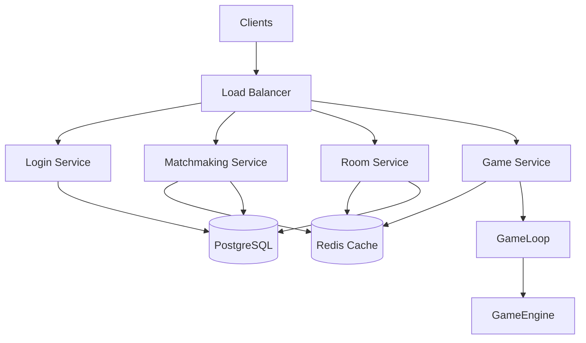

# Server Design - Kung Fu Chess

## 1. מטרת המערכת

המערכת היא משחק שחמט בזמן אמת המבוסס על ארכיטקטורת Client-Server.

השרת אחראי על:

- ניהול מצב המשחק.
- הרצת חוקי המשחק.
- התאמת משתמשים.
- ניהול חדרים.
- שמירת מידע.

המטרה היא לתכנן מערכת שרתית שיכולה לתמוך בכמות גדולה של משתמשים במקביל באמצעות חלוקת אחריות בין שירותים שונים, הרצת מספר מופעים ושימוש בתשתיות Cloud.

# 2. דרישות מערכת

המערכת צריכה לתמוך בדרישות הבאות:

- תמיכה ב־100 מיליון משתמשים רשומים.
- תמיכה ב־10 מיליון משתמשים פעילים המשחקים במקביל.
- תמיכה במספר גדול של משחקים בו זמנית.
- אפשרות לכל משתמש להתחבר לכל חדר.
- התאמת משתמשים לפי Rating.
- ניהול חדרים וצופים.
- שמירת משתמשים, דירוגים ותוצאות משחקים.
- יכולת הגדלה דינמית בהתאם לעומס.

# 3. ארכיטקטורת מערכת

המערכת מחולקת למספר שירותים עצמאיים.

מבנה כללי:



## Load Balancer

אחראי על:

- קבלת בקשות מהלקוחות.
- ניתוב בקשות לשירות המתאים.
- חלוקת עומסים בין מופעים שונים.

Load Balancer אינו מכיל לוגיקה עסקית.

## Login Service

אחראי על:

- התחברות משתמשים.
- בדיקת פרטי משתמש.
- יצירת Session.
- טעינת מידע בסיסי של המשתמש.

## Matchmaking Service

אחראי על:

- ניהול תור המתנה למשחק.
- חיפוש משתמשים לפי Rating.
- יצירת משחק חדש לאחר מציאת התאמה.

## Room Service

אחראי על:

- יצירת חדרים.
- שמירת רשימת חדרים.
- ניהול משתמשים בחדר.
- ניהול צופים.

Room Service אינו מנהל את חוקי המשחק.

## Game Service

אחראי על:

- ניהול משחקים פעילים.
- שמירת הקשר בין משתמש למשחק.
- קבלת פקודות משחק.
- שליחת Snapshots למשתמשים.

כל Game Service מנהל חלק מהמשחקים בלבד.

### Communication עם Client

Game Service משתמש בתקשורת WebSocket כדי להעביר עדכוני משחק בזמן אמת.

ה־Client שולח פקודות דרך WebSocket והשרת מחזיר עדכוני מצב.

## GameLoop

אחראי על:

- הפעלת עדכון מחזורי של משחקים.
- שליחת עדכון מחזורי לכל המשחקים.
- בקשת Snapshot מעודכן.

GameLoop אינו מכיר משתמשים ואינו מנהל תקשורת ישירה מול Client.

# 4. חלוקת Services ו־Scale

כדי לתמוך בעומס גדול המערכת תרוץ באמצעות מספר מופעים של שירותים שונים.

לדוגמה:

כל מופע מטפל בחלק מהעומס.

כאשר יש עומס גבוה ניתן להוסיף מופעים נוספים ללא שינוי בקוד.

## ניהול משחקים בין מספר Game Services

כאשר קיימים מספר Game Services צריך לדעת איפה כל משחק נמצא.

לשם כך משתמשים ב־Game Registry.

מבנה:

```
Game ID -> Game Service Instance
```

לדוגמה:

```
Game 1001 -> Game Service 2

Game 1002 -> Game Service 5
```

כך משתמשים יכולים לשחק אחד מול השני גם כאשר הם מחוברים למופעים שונים של השירותים.

# 5. זרימות מרכזיות

## 5.1 Login

הלקוח אינו מחליט את מצב המערכת.

השרת מחזיר את ה־State המתאים.

## 5.2 Play / Matchmaking

Matchmaking מחפש משתמש עם Rating מתאים.

לאחר מציאת התאמה המשחק משויך ל־Game Service מסוים.

## 5.3 שליחת פעולה במשחק

ה־Client רק שולח פקודות ומציג תוצאה.

כל הלוגיקה נמצאת בצד השרת.

## 5.4 עדכון משחקים

Game Service מקבל עדכוני משחק דרך GameLoop.

GameLoop מפעיל מחזורי עדכון ושומר על סנכרון מצב המשחקים.

## 5.5 Rooms

Room Service מנהל את החדר.

Game Service מנהל את המשחק עצמו.

# 6. Database Design

למערכת נבחר PostgreSQL כמסד הנתונים המרכזי.

SQLite אינו מתאים למערכת בסדר גודל גדול מכיוון שהוא מבוסס על קובץ יחיד ופחות מתאים לסביבה מבוזרת עם עומס גבוה.

PostgreSQL מתאים לניהול מידע כגון:

- משתמשים.
- דירוגים.
- תוצאות משחקים.
- היסטוריית משחקים.

דוגמה:

## Users

```text
id
username
password_hash
rating
created_at
```

## Games

```text
id
player1
player2
winner
created_at
duration
```

השירותים ניגשים למסד הנתונים דרך שכבת שירות ולא ישירות מהלקוח.

במערכת גדולה ניתן להשתמש ב:

- Read Replicas.
- Connection Pooling.
- חלוקת מידע לפי צורך.

בנוסף ניתן להשתמש ב־Redis עבור מידע זמני:

- Sessions.
- Game Registry.
- Matchmaking Queue.
- Game State זמני.

Redis מאפשר גישה מהירה למידע שנדרש בזמן אמת ומפחית עומס ממסד הנתונים.

# 7. Scale ו־Docker

כל שירות ירוץ בתוך Docker Container נפרד.

לדוגמה:

```
Container 1
Login Service

Container 2
Matchmaking Service

Container 3
Room Service

Container 4
Game Service
```

יתרונות:

- סביבת הרצה אחידה.
- פריסה מהירה.
- אפשרות להוסיף מופעים נוספים.
- בידוד בין שירותים.

לדוגמה:

לפני:

```
Game Service

3 Containers
```

אחרי:

```
Game Service

20 Containers
```

כאשר העומס גדל מוסיפים מופעים נוספים.

# 8. Kubernetes / K3s

Kubernetes אחראי על ניהול ה־Containers.

תפקידים:

- יצירת מופעים נוספים.
- חלוקת עומסים.
- הפעלה מחדש במקרה של תקלה.
- ניהול מחזור החיים של השירותים.

K3s הוא פתרון קל יותר המבוסס על Kubernetes ומתאים לסביבות שבהן נדרש ניהול פשוט יותר.

## Service Communication

השירותים מתקשרים ביניהם באמצעות תקשורת פנימית.

לדוגמה:

Client -> Load Balancer -> Service

Service -> Internal API -> Service אחר

תקשורת בין שירותים מאפשרת הפרדת אחריות ומאפשרת להגדיל כל שירות בנפרד בהתאם לעומס.

# 9. Network Estimation

נניח:

- 10 מיליון משתמשים פעילים.
- משתמש מבצע פעולה אחת כל 2 שניות.

חישוב:

```
10,000,000 / 2
```

=

```
5,000,000 פעולות בשנייה
```

אם גודל הודעת פעולה הוא בערך 100 Bytes:

```
5,000,000 × 100
```

=

```
500,000,000 Bytes בשנייה
```

המרה:

```
500,000,000 Bytes/sec ≈ 500 MB/sec
```

כלומר מספר Gigabit/sec של תעבורה.

זהו עומס משמעותי ולכן לא ניתן להסתמך על שרת יחיד.

המערכת צריכה:

- מספר שרתים.
- חלוקת עומסים.
- שליחת מידע רק למשתמשים הרלוונטיים.
- שימוש בתקשורת יעילה.

בנוסף קיימת תעבורה של:

- Snapshots.
- עדכוני מצב.
- הודעות מערכת.

# 10. ניהול מחזור חיים של משחק

משחק הוא משאב זמני.

כאשר משחק מתחיל:

- Matchmaking משייך את המשתמשים למשחק.
- Game Service מקבל אחריות על ניהול המשחק.
- מצב המשחק נשמר בזיכרון של ה־Game Service.

כאשר המשחק מסתיים:

- Game Service מעדכן את תוצאת המשחק.
- הנתונים נשמרים במסד הנתונים.
- המשאב של המשחק משתחרר.

מכיוון שמשחקים נמשכים זמן קצר יחסית, Game Service לא יוצר Container חדש לכל משחק.

במקום זאת:

- Container אחד מנהל מספר משחקים.
- Kubernetes מוסיף Containers חדשים רק כאשר יש עומס.

# 11. סיכום Design

המערכת מתוכננת כארכיטקטורת Client-Server מבוזרת.

חלוקת האחריות:

- Login Service - משתמשים וחיבורים.
- Matchmaking Service - התאמת שחקנים.
- Room Service - ניהול חדרים.
- Game Service - ניהול משחקים פעילים.
- GameLoop - עדכון משחקים.
- PostgreSQL - שמירת מידע קבוע.
- Redis - מידע זמני וגישה מהירה.

השימוש ב־Docker וב־Kubernetes מאפשר להגדיל את המערכת בהתאם לעומס.

חלוקת המשחקים בין מספר Game Services מאפשרת תמיכה בכמות גדולה של משחקים במקביל.

הפרדת האחריות בין השירותים מאפשרת מערכת גמישה, ניתנת להרחבה ומתאימה לעומסים גדולים.